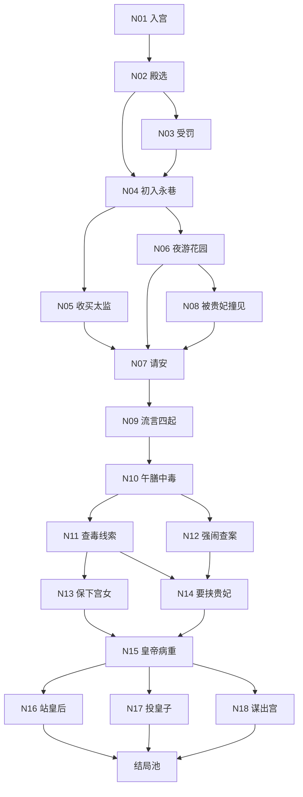

# 宫斗本第一册节点清单与分支图

## 目标

本文件把第一册从“方向蓝图”进一步细化为可直接转代码的数据清单。

这里先定义：

- 节点列表
- 节点功能
- 主分支流向
- 回响点落位

暂不在本文件中写正式代码字段，只定义结构。

## 主图原则

第一册采用：

- 章节内局部分支
- 章节间阶段回收
- 终局前再次分化

这样既有分支感，也能控制总量。

## 主分支图

说明：

- 图中是主节点，不包含所有概率插入事件
- 实际数据里会有额外事件节点和死亡节点
- `N07`、`N09`、`N15` 是重要汇合点

## 节点分层

建议把第一册节点拆成四类。

### A 类：主决策节点

玩家必须做选择，决定路线倾向。

- `N01 intro_selection`
- `N02 selection_day`
- `N04 first_night_quarters`
- `N07 morning_greeting`
- `N10 poisoned_meal`
- `N11 investigate_clue`
- `N15 emperor_falls_ill`
- `N16 final_side_empress`
- `N17 final_side_prince`
- `N18 final_escape`

### B 类：事件节点

用于承接随机结果或前文回响。

- `N03 punished_in_hall`
- `N05 bribe_eunuch_event`
- `N06 garden_encounter`
- `N08 caught_by_consort`
- `N09 rumor_spreads`
- `N12 forced_public_investigation`
- `N13 protect_maid`
- `N14 blackmail_consort`

### C 类：死亡节点

用于立即失败或半终局失败。

- `D01 cold_palace_death`
- `D02 poisoned_in_confinement`
- `D03 wine_of_death`
- `D04 escape_fall`

### D 类：结局节点

用于结算与评分。

- `E01 mother_of_realm`
- `E02 favored_noble_consort`
- `E03 trusted_consort`
- `E04 behind_the_curtain`
- `E05 shadow_powerbroker`
- `E06 peaceful_survivor`
- `E07 lonely_old_age`
- `E08 discarded_pawn`
- `E09 purged_after_scheme`
- `E10 fake_death_escape`
- `E11 river_town_retreat`
- `E12 cold_palace_decline`
- `E13 gifted_poison`
- `E14 failed_escape`

## 主节点说明

## N01 `intro_selection`

功能：

- 定下玩家初始风格
- 产出首批标记

建议选项：

- 低调入宫
- 精心打扮，一鸣惊人
- 暗中观察秀女与嬷嬷

核心回响：

- 是否高调
- 是否先拿到情报视角

## N02 `selection_day`

功能：

- 让玩家第一次感到“被上位者审视”
- 决定初始风险值

建议选项：

- 展现才艺
- 谦卑守礼
- 故作失误引人注意

随机插入：

- 故作失误可能成功引起怜惜，也可能变成 `N03`

## N03 `punished_in_hall`

功能：

- 让高风险选择有真实代价
- 给“隐忍”和“记仇”两个后续倾向落点

## N04 `first_night_quarters`

功能：

- 第一次建立“永巷”和“消息渠道”
- 选择是投资关系还是赌偶遇

建议选项：

- 收买太监
- 安分休息
- 夜游花园

## N05 `bribe_eunuch_event`

功能：

- 给情报线埋入口
- 同时预留日后反咬风险

## N06 `garden_encounter`

功能：

- 宠爱线起飞点
- 给“被撞见”事件制造前置

随机结果：

- 从容应对
- 表演过头
- 碰巧被贵妃或宫女看到

## N07 `morning_greeting`

功能：

- 第一处强回响汇合节点
- 根据前史替换文本和选项

文本条件来源：

- 是否夜游
- 是否高调
- 是否得罪贵妃
- 是否拿到太监提醒

选项差异来源：

- 观察流玩家可多一个“借话试探”选项
- 高调玩家更容易出现“被点名回应”

## N09 `rumor_spreads`

功能：

- 正式把前史转化为集体舆论压力
- 让玩家体验“宫里会记账”

关键设计：

- 高调或夜游玩家更容易被影射
- 有情报者可提前防守
- 得罪贵妃者更易引爆高风险分支

## N10 `poisoned_meal`

功能：

- 中盘重大危机
- 从“应对风评”切入“查案与站队”

建议选项：

- 叫太医
- 忍着观察
- 借机做局
- 直接闹大

## N11 `investigate_clue`

功能：

- 正式引入“证据”和“把柄”
- 路线开始明显分化

建议选项：

- 悄悄追查下毒宫女
- 先找可信的人探口风
- 压下不动，留作后手

## N12 `forced_public_investigation`

功能：

- 给冲动玩家明显代价
- 但保留其进入权谋线的可能

## N13 `protect_maid`

功能：

- 决定是否获得长期盟友
- 为后续证词、夜逃帮助、消息传递做铺垫

## N14 `blackmail_consort`

功能：

- 权谋线核心节点
- 提供短期收益和长期背刺风险

## N15 `emperor_falls_ill`

功能：

- 第二个强汇合节点
- 结算前史积累，迫使最终站队

这里要读取：

- 皇帝关系
- 皇后关系
- 贵妃关系
- 是否保下宫女
- 是否握有把柄
- 是否提前准备逃路

## N16 `final_side_empress`

功能：

- 对应秩序、保守、借正统上位

主要导向：

- `E01 mother_of_realm`
- `E04 peaceful_survivor`
- `E10 cold_palace_decline`

## N17 `final_side_prince`

功能：

- 对应投资、操盘、风险政治

主要导向：

- `E03 behind_the_curtain`
- `E06 discarded_pawn`
- `E07 purged_after_scheme`

## N18 `final_escape`

功能：

- 对应主动抽身
- 必须被当作完整路线，而不是失败分支

主要导向：

- `E08 fake_death_escape`
- `E09 river_town_retreat`
- `E12 failed_escape`

## 概率事件清单建议

第一册建议固定 10 个左右概率事件，集中做“被撞见、消息是否提前送达、证物是否保住”这类事件。

- `R01` 花园偶遇时被贵妃撞见
- `R02` 收买太监后，提前收到请安警告
- `R03` 谣言在你反应前已扩散
- `R04` 中毒后太医是否可信
- `R05` 下毒宫女是否愿意开口
- `R06` 贵妃是否察觉你握有把柄
- `R07` 皇后是否愿意保你
- `R08` 皇帝病重消息是否被提前泄露
- `R09` 夜逃时宫门守卫是否换班
- `R10` 盟友是否在最后时刻出手

## 回响检查表

首册最重要的 5 个前史，建议在写节点时逐项打勾。

### `made_showy_debut`

必须影响：

- `N07` 文本
- `N09` 风评强度
- 至少 1 个结局权重

### `bribed_eunuch`

必须影响：

- `N07` 是否提前预警
- `N10` 是否多一个规避方案
- `N18` 逃离线成功率

### `garden_encounter`

必须影响：

- `N07` 请安时针对性
- `N15` 皇帝关系基础值
- 宠爱线结局权重

### `protected_maid`

必须影响：

- `N15` 证词支持
- `N18` 是否有人接应
- 至少一个生存或逃离结局

### `blackmail_consort`

必须影响：

- `N15` 权谋资源
- `N16` 皇后线难度
- `N17` 被反噬概率

## 建议下一步产物

在本文件之后，最适合继续补的是：

1. 每个节点的正式 schema 草案
2. 第一册结局触发表
3. 第一册回响矩阵表
